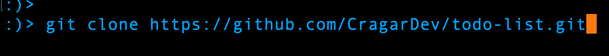
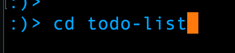
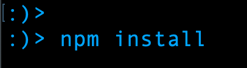
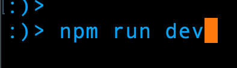

# Running -  My Todo List

My Todo List was built using Angular, Typescript, nodejs, and utilizing json-server as the database package

Follow the step below to run this web app:

1. git clone repo

    

2. cd into 

    

3. run `npm install` to install the dependencies

     

4. run `npm run dev` this will start both front and backend servers simultaneously

     

5. Open your browser to http://localHost:4200 and you should see the app working
6. to check out the data in the backend go to http://localHost:5000/todos

To exit enter:  `control C` in the terminal

## Thanks for taking a look at My Todo List
### The app in action:

## Further help

To get more help on the Angular CLI use `ng help` or go check out the [Angular CLI Overview and Command Reference](https://angular.io/cli) page.
